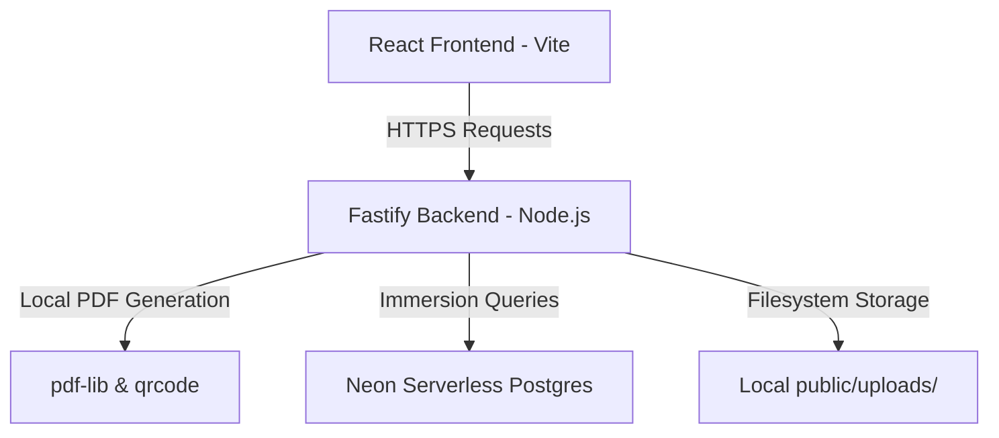

# Project Guide: Blockchain-Based Certificate Generation and Validation System

This guide outlines the system architecture, generation pipeline, validation layers, and security mechanism of the project. Use this document to explain the core concepts and design decisions to your mentor.

---

## 1. Project Overview & Objective
The core objective of this project is to eliminate **credential fraud and certificate forgery**. 

Traditional PDF certificates can be easily manipulated (editing names, dates, or grades using standard PDF editors) and are difficult for third-party recruiters to verify. This system solves the problem by implementing a **synchronized Generation and 4-Layer Cryptographic Audit pipeline**:
* **Generation**: Automates bulk certificate generation mapping participant lists (CSV/Excel) on design templates. It injects hidden identity records (steganography) and overlays a dynamic visual verification anchor (QR Code).
* **Validation**: Performs a real-time cryptographic audit that instantly verifies PDF contents and queries the central registry to guarantee the document has not been tampered with.

---

## 2. System Architecture

The project is structured into three main layers:



1. **Frontend (Vite + React)**:
   - **Studio Layout Canvas**: Allows the creator to upload templates, select dynamic fields, and map certificate data.
   - **Audit Dashboard**: Houses the drag-and-drop verification interface that updates step status indicators in real-time as each layer is verified.
2. **Backend (Fastify + Node.js)**:
   - **Local Generation Engine**: Parses Excel/CSV files, matches fonts, generates dynamic QR codes, injects steganographic signatures, and compiles ZIP packages locally.
   - **Bypass File loader**: Resolves network deadlocks by reading local template uploads directly from the server disk rather than making loopback HTTP requests to itself.
3. **Database Ledger (Neon Serverless PostgreSQL)**:
   - Serves as the cloud-hosted registry node recording issuance timestamps, recipient names, custom UUIDs, file sizes, and SHA-256 cryptographic fingerprints.

---

## 3. The 4-Layer Verification Mechanism

When a certificate is uploaded to the verification portal, the system executes a 4-layer check:

```
+-----------------------------------------------------------------------+
|  LAYER 1: QR CODE ANCHOR (Visual Link Extraction)                     |
|  Reads visual matrix -> Extracts secure unique ID parameters.         |
+------------------------------------+----------------------------------+
                                     |
                                     v
+-----------------------------------------------------------------------+
|  LAYER 2: CRYPTOGRAPHIC INTEGRITY (SHA-256 Hashing)                   |
|  Computes raw binary fingerprint -> Checks for post-issuance edits.   |
+------------------------------------+----------------------------------+
                                     |
                                     v
+-----------------------------------------------------------------------+
|  LAYER 3: METADATA EXTRACTION (Steganography)                         |
|  Parses hidden document fields -> Extracts embedded UUID tag.         |
+------------------------------------+----------------------------------+
                                     |
                                     v
+-----------------------------------------------------------------------+
|  LAYER 4: REGISTRY CONSENSUS (Ledger Authentication)                  |
|  Queries cloud node -> Matches calculated hash/size against database.  |
+-----------------------------------------------------------------------+
```

### **Layer 1: QR Code Anchor (Decryption Entrypoint)**
* **What it does**: Reads the visual QR code embedded on the document.
* **How it works**: Decodes the matrix vector to extract the verification link query parameter: `?id=a19294c8-264b-4838-8373-19b603f10752`.

### **Layer 2: Cryptographic Integrity (SHA-256 Hashing)**
* **What it does**: Generates a digital fingerprint of the uploaded file.
* **How it works**: Reads the binary stream of the PDF file buffer and computes its SHA-256 hash. If even one pixel, letter, or byte is changed, the computed hash changes completely.

### **Layer 3: Metadata Extraction (Steganography)**
* **What it does**: Extracts the hidden digital keys injected into the document structural objects.
* **How it works**: Decodes the PDF document's `Subject` and `Keywords` properties. It applies a regex sanitizer `/[^a-fA-F0-9-]/g` to strip away hidden byte-order marks (`\uFEFF`) or null bytes, extracting a clean UUID.

### **Layer 4: Registry Consensus (Database Ledger Audit)**
* **What it does**: Queries the secure ledger to verify the certificate's authenticity.
* **How it works**: Queries the cloud database (`certificates` table) using the extracted UUID. It checks:
  1. Does a record exist?
  2. Does the calculated SHA-256 hash match the registered hash?
  3. Does the uploaded file size match the registered file size?
  If all checks pass, it returns **Consensus Achieved**.

---

## 4. Mentor Q&A (Viva / Project Defense Guide)

These are questions your mentor is highly likely to ask, along with the correct technical answers:

### **Q1: If you aren't running decentralized blockchain nodes, how can you claim this is a "blockchain-based" system?**
* **Answer**: 
  > *"For prototype demonstration, the cloud-hosted Neon database serves as a **single logical Consortium Node**. The database table represents the ledger state store, and the backend routes act as the smart contract validator. The validation sequence (generating a cryptographic hash, embedding a structural tag, and cross-checking a ledger) mirrors the exact architecture of a Proof-of-Authority (PoA) blockchain network."*

### **Q2: Why do first 3 layers pass on a modified/fake certificate, but Layer 4 fails?**
* **Answer**: 
  > *"Layers 1, 2, and 3 only analyze the physical PDF document (extracting QR codes, calculating the hash, and reading metadata). They pass as long as the PDF is structurally valid. Layer 4 is the only layer that queries the database ledger to verify if this calculated hash and UUID are actually registered in the registry. If a certificate is forged or modified, Layer 4 detects the hash mismatch and fails the audit."*

### **Q3: Why do we not register "Preview PDFs" in the database?**
* **Answer**: 
  > *"Preview PDFs are draft templates created during layout alignment. They are not finalized credentials. Registering drafts would clutter the blockchain ledger with invalid records. Only final certificates generated in bulk from a CSV/Excel list are officially minted and written to the database ledger."*

### **Q4: How does the system handle template uploads locally without Cloudinary?**
* **Answer**: 
  > *"We implemented a local filesystem fallback. If Cloudinary credentials are not configured in the `.env` file, the server saves the uploaded design template to a local `/public/uploads/` directory. To prevent local networking deadlocks when the server requests files from itself, the filesystem bypasses the HTTP stack and reads the file directly using Node's `fs.readFileSync`."*
